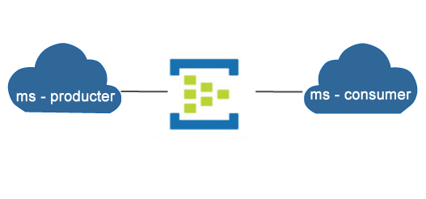

# Produce and consume events using Java and the library Spring Cloud Stream Binder from Spring Boot Application

Expose a Restful API to consume events from a `Event Hub` instance.   
Expose a Restful API to send events to a `Event Hub` instance.   

## Technology

- [Azure Portal](https://portal.azure.com/)
- [JDK8](https://www.oracle.com/java/technologies/downloads/) or later
- [Spring Cloud Stream](https://spring.io/blog/2019/04/02/event-driven-java-with-spring-cloud-stream-and-azure-event-hubs-guest-post)
- Maven